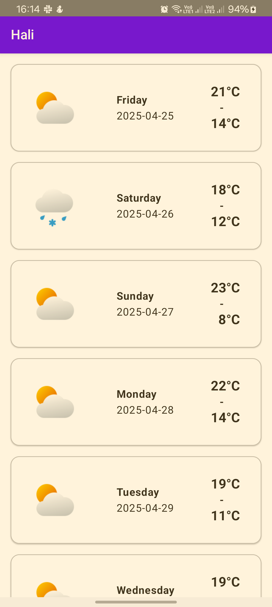
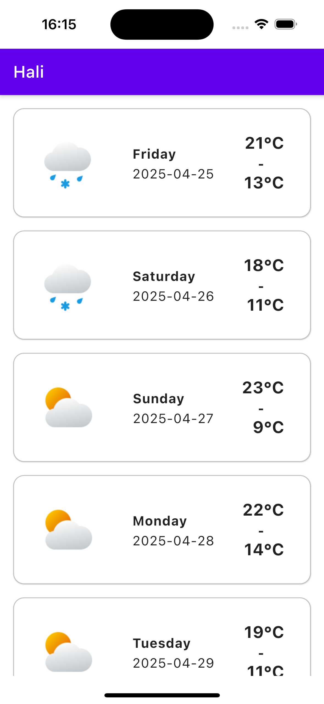
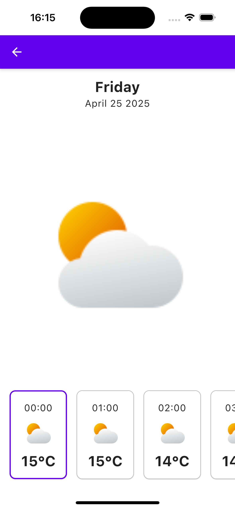

## Hali

A simple app to fetch weather forecast
from [open-meteo](https://open-meteo.com/en/docs?daily=temperature_2m_max,temperature_2m_min,precipitation_sum),
built using Kotlin Multiplatform. It targets iOS and Android platforms.

## Prerequisites

To run the app, you will need:

- Android Studio - to run the android app
- Xcode - to be able to run the iOS app

## Architecture

The app has been built using a modularized layered architecture. The app has the following modules:

- **composeApp** - contains the shared logic and the android app
- **iosApp** - contains the setup for the iOS app

### Screenshots

#### android

|                         Home                         |                         Details                         |
|:----------------------------------------------------:|:-------------------------------------------------------:|
|  |  |

#### ios

|                       Home                       |                       Details                       |
|:------------------------------------------------:|:---------------------------------------------------:|
|  |  |

#### Libraries and tech stack

- [Kotlin](https://kotlinlang.org/) - programming language
- [Kotlin Multiplatform](https://www.jetbrains.com/kotlin-multiplatform/) - Multiplaform framework
- [Compose Multiplatform](https://www.jetbrains.com/lp/compose-multiplatform/) - Declarative
  framework for sharing UIs across multiple platforms. Based on Kotlin and Jetpack Compose.
- [Koin](https://github.com/google/hilt](https://insert-koin.io/)) - a pragmatic lightweight
  dependency injection framework for Kotlin & Kotlin Multiplatform.
- [Ktor Client](https://ktor.io/) - networking client framework
- [KotlinX Serialization](https://github.com/Kotlin/kotlinx.serialization) -
  Serialization/Desirialization of JSON response from network.
- [KtLint](https://github.com/pinterest/ktlint) - An anti-bikeshedding Kotlin linter with built-in
  formatter

#### CI/CD

- [Github Actions](https://github.com/kibettheophilus/hali/tree/master/.github/workflows) - to run
  tests, run lint checks and assemble apk. The deployment workflows are WIP.

## Improvements

Given enough time, I would have loved to:

- UI/UX - improve the design of the app.
- Pick user location - currently the location(longitude/latitude) is static and timezone is
  `Asia/Tokyo`, the app should pick user's location when they open and show them weather forecast
  based on their current location.
- Allow user to search - linked to above, let users search and view forecast for other places other
  than their current location
